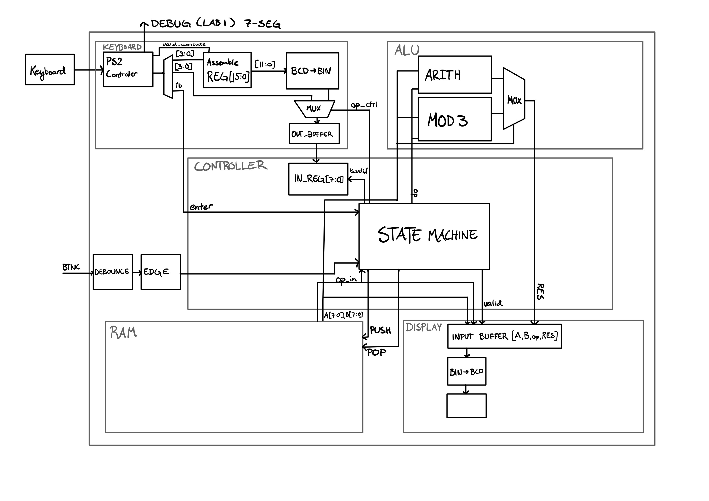
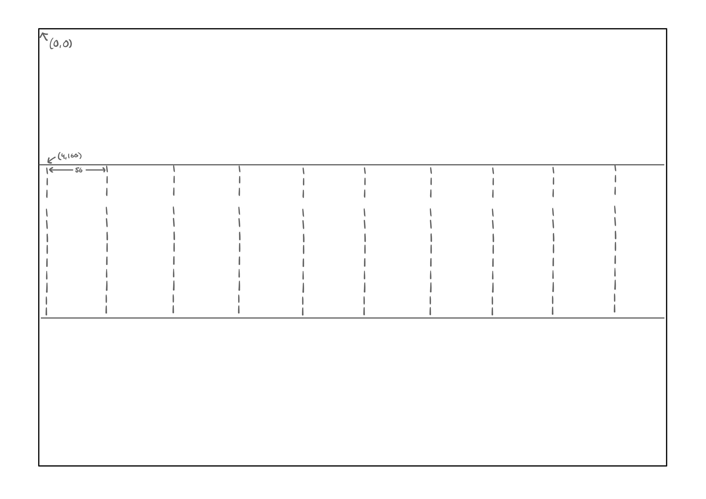
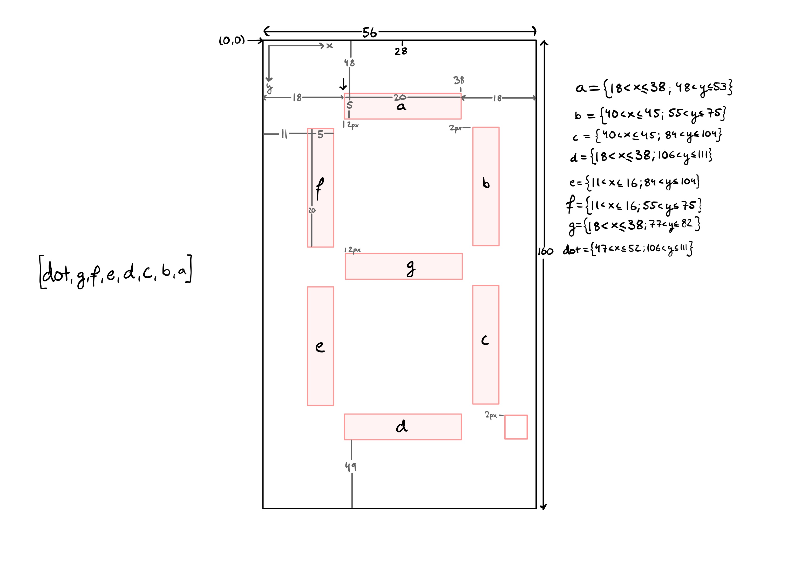
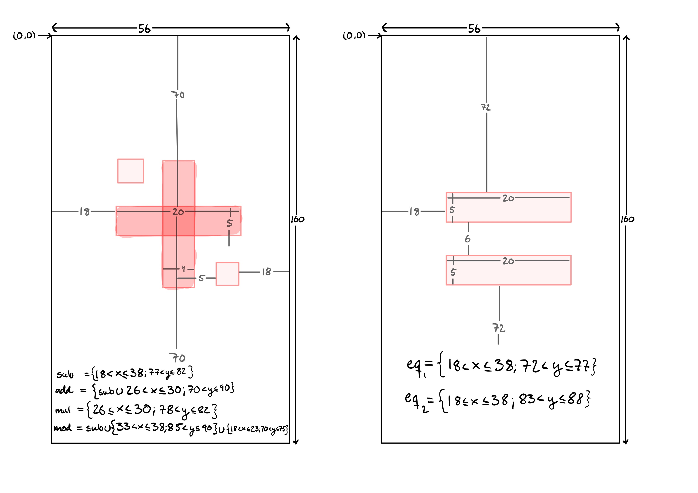

# Remaining

1. Koppla ihop Keyboard
    - Komplettera för fler inputs?
2. Koppla ihop ALU
3. Toppmodul för Keyboard och ALU
4. Koppla ihop med VGA
5. Implementera minne

# OPERATIONS
|Operation  | 8'dXXX | 
|-------|-----|
| - | 130  | 
| + | 131  | 
| * | 132  | 
| % | 133  | 

# Display

